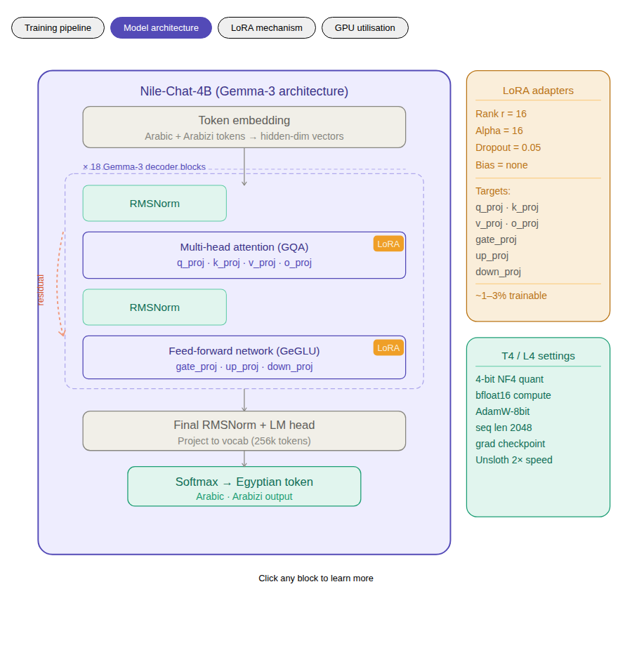
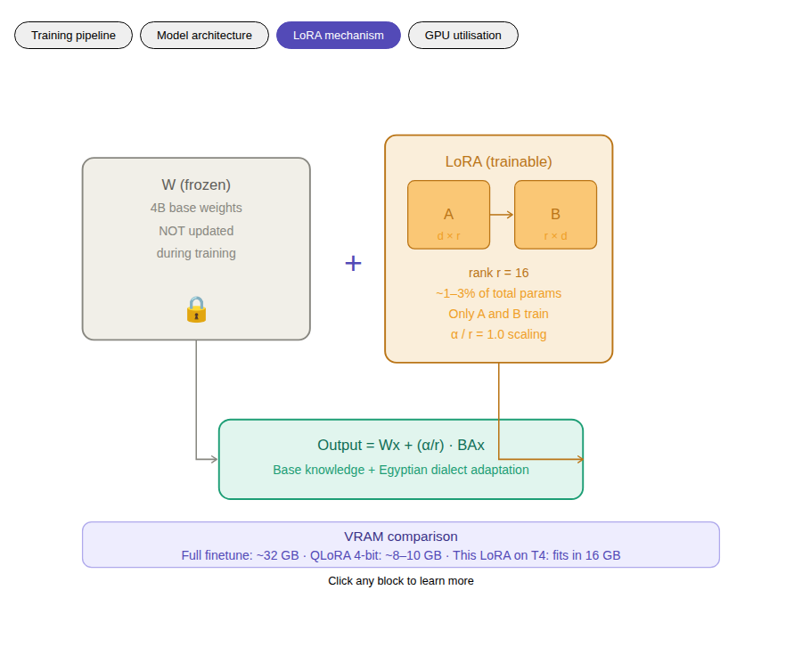
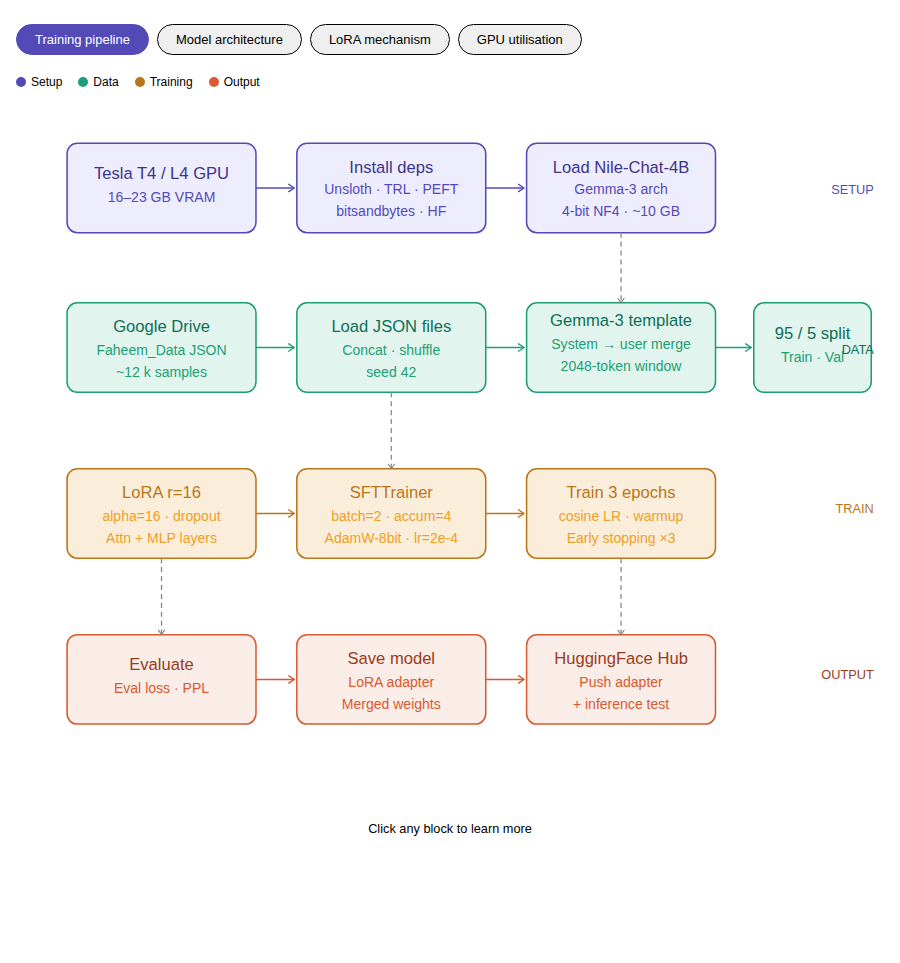
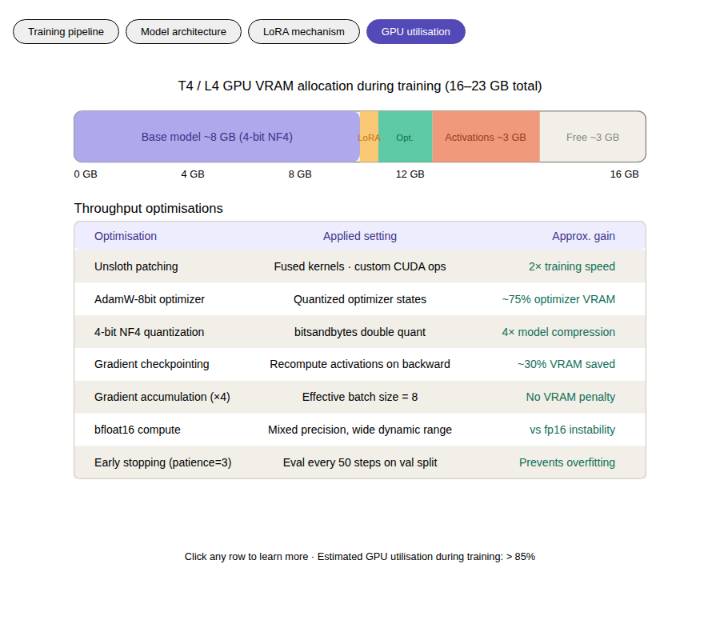

# Faheem: Fine-Tuning Nile-Chat on Egyptian Dialect

This project fine-tunes **[MBZUAI-Paris/Nile-Chat-4B](https://huggingface.co/MBZUAI-Paris/Nile-Chat-4B)** (based on the Gemma-3 architecture) — an Egyptian Arabic Large Language Model — using the custom **Faheem dataset**. The fine-tuning process employs **QLoRA (4-bit quantization)** to ensure compatibility with GPUs containing at least 16GB of VRAM, such as the NVIDIA Tesla T4.

The model is developed to function as an Egyptian educational assistant ("Faheem") intended for students aged 6 to 18. It is designed to support both Arabic script and Franco-Arabic (Arabizi). 

---

## Model Access

The finalized fine-tuned adapter and model weights are publicly available on the Hugging Face Hub:
- **[Faheem Nile-Chat Egyptian Adapter](https://huggingface.co/mohammed-ham7a/faheem-nile-chat-egyptian-adapter)**

---

## Architecture Overview

| Component | Detail |
|-----------|--------|
| **Base Model** | `MBZUAI-Paris/Nile-Chat-4B` (Gemma-3 architecture) |
| **Fine-Tuning Method** | QLoRA (4-bit NF4 quantization + LoRA adapters) |
| **Training Library** | Unsloth + HuggingFace TRL / SFTTrainer |
| **Target GPU** | Tesla T4 (16GB) / A100 (40GB) |
| **Dialect Support** | Arabic Script + Franco-Arabic (Arabizi) |

### LoRA Mechanism

QLoRA adapters facilitate the efficient fine-tuning of the Nile-Chat model without the necessity of enterprise-grade hardware. 

---

## Dataset (Faheem_Data_8500)

The model is fine-tuned on a curated and structured dataset comprising **9,000 multi-turn conversations**. This dataset is specific to the Egyptian curriculum and typical educational student interactions. 

### Sub-datasets:
- **Arabic/English Mix (`AR_EN_1500.json`)**: 2,000 samples
- **Roleplay Boundaries (`faheem_boundaries_1500.json`)**: 1,500 samples
- **Scientific Concepts (`faheem_science_1000.json`)**: 1,000 samples
- **Mathematics and Equations (`math_1000.json`, `mathematic equations_1000.json`)**: 2,000 samples
- **Typographical Corrections (`faheem_typo_1000.json`)**: 1,000 samples
- **Motivation and Mentorship (`faheem_motivation_500.json`)**: 500 samples
- **Polite Refusals (`faheem_refusal_500.json`)**: 500 samples
- **Multi-turn Dialogues (`multi_turn_500.json`)**: 500 samples

---

## Training Pipeline

The training pipeline relies on the Unsloth library to optimize training speed and minimize memory overhead. 

### Pipeline Steps:

1. **Environment Preparation:** Install essential libraries including Unsloth, TRL, PEFT, and Transformers.
2. **Dataset Loading:** Aggregate all JSON components into a unified training dataset.
3. **Base Model Initialization:** Load the Nile-Chat model in 4-bit precision.
4. **LoRA Application:** Integrate low-rank adapters explicitly targeting the projection layers.
5. **Conversation Formatting:** Apply the standard Gemma-3 chat template across all conversation instances.
6. **Model Training:** Deploy `SFTTrainer` configured with early stopping and predefined optimal hyperparameters.
7. **Evaluation:** Analyze generation quality and compute perplexity scores.
8. **Artifact Deployment:** Merge LoRA weights (as an optional step) and deploy the finalized model to the HuggingFace Hub.

### GPU Utilization

The implementation of 4-bit quantization combined with Unsloth optimizations ensures that the training protocol remains viable on consumer-grade or free-tier cloud GPUs (e.g., Google Colab's T4 instances):

### Execution Guide

To execute the fine-tuning notebook:
1. Open `NoteBooks/FineTune_NileChat_4B.ipynb` in Google Colab or a local Jupyter environment.
2. Verify that the computing environment provisions a minimum of 16GB VRAM (a Tesla T4 GPU is adequate).
3. Install the dependencies listed in the initial cells; utilizing Unsloth is highly recommended.
4. Confirm that the dataset configuration path points to the bundled `Faheem_Data_8500` directory.
5. Execute the notebook cells sequentially to initiate the training procedure.

---

*Note: This project is a component of the Egyptian Educational Assistant initiative, developed to provide students with accessible, culturally-aware, and intelligent conversational interactions.*
